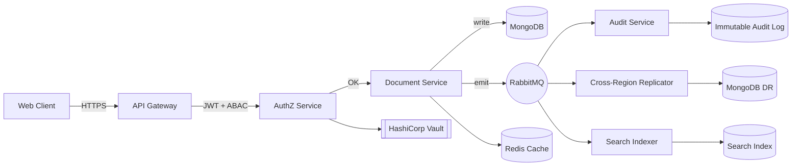

<!--
  ─────────────────────────────────────────────────────────────
  PRABHAKAR KUMAR  ·  Senior Software Engineer
  GitHub: https://github.com/prabhakar713
  ─────────────────────────────────────────────────────────────
  Rich desktop layout preserved. Only tables that clip on 375px
  mobile viewports were restructured (4-col → 2×2, 4×2 → 2×4,
  3×2 project cards → 2×3, and About Me stacked so the YAML
  <pre> block doesn't overflow). Every image URL served by a
  currently-healthy public service.
-->

<!-- ══════════════════════ 1. ANIMATED HEADER ══════════════════════ -->

<!-- ══════════════════════ 3. HERO SECTION ══════════════════════ -->

  

<!-- ══════════════════════ 2. ANIMATED TYPING SVG ══════════════════════ -->

  

<!-- Quick-stat capsule row — inline badges (wrap naturally on any width). -->

<!-- Gradient divider — matches the header's palette for visual continuity. -->

 

<!-- ══════════════════════ 4. PROFESSIONAL INTRODUCTION ══════════════════════ -->

## &nbsp;The Pitch

Most engineers pick one lane. I built a career at the intersection of five.

> I design and ship full systems end-to-end — **backend, frontend, infrastructure, security, and the AI layer on top** — then I sit *with the customer* to make sure it survives production. That combination — **builder + forward-deployed problem-solver + AI engineer** — is why enterprise BFSI teams across APAC and North America have trusted me with their platform experience for 4+ years.

I don't hand off. I don't wait for a ticket. If a customer is blocked at 2 AM, I ship the fix, own the rollback plan, and write the postmortem the same week.

 

<!-- ══════════════════════ 5. ABOUT ME (stacked so YAML <pre> doesn't overflow on mobile) ══════════════════════ -->

## About Me

Senior Software Engineer based in **Bangalore, India**, currently building a secure Virtual Data Room platform for regulated enterprises. Previously **Senior Solution Engineer at Vymo**, where I owned CRM platform delivery for banks, insurers, and financial institutions across APAC and North America.

I care about three things, in this order:

1. **Customer outcome** — does the change actually move a metric that matters to the business?
2. **System integrity** — will it still be correct under load, failure, and adversarial input?
3. **Team leverage** — did I leave the codebase, docs, or on-call runbook better than I found it?

My comfort zone spans **distributed systems, event-driven architectures, secure authorization (RBAC/ABAC), and LLM-powered product features** — glued together with pragmatic engineering.

<pre lang="yaml">
name:         Prabhakar Kumar
role:         Senior Software Engineer
location:     Bangalore, India
experience:   4+ years
domains:
  - Enterprise SaaS
  - BFSI / Fintech
  - CRM Platforms
  - Secure Document Rooms
  - Applied AI / LLM
stack:        polyglot full-stack
availability: open to select roles
</pre>

 

<!-- ══════════════════════ 6. CAREER TIMELINE ══════════════════════ -->

## Career Timeline

<table>
<tr>
<td width="50%" valign="top">

### Senior Software Engineer
`Feb 2026 — Present`
**Secure Virtual Data Room Platform**
Enterprise-grade document collaboration for M&A, due-diligence, and regulated deal-rooms.

- Designed **RBAC + ABAC** authorization with per-document, per-attribute policy evaluation.
- Built **event-driven microservices** on **RabbitMQ** with idempotent consumers and DLQs.
- Tuned **MongoDB** aggregation pipelines for high-volume cross-region replication.
- Shipped on **Kubernetes** with **Helm**, **Redis** caching, and **HashiCorp Vault** for secret rotation.
- Wrote the audit-logging framework that powers compliance evidence for enterprise customers.

</td>
<td width="50%" valign="top">

### Senior Solution Engineer · Vymo Technologies
`Jul 2022 — Feb 2026`
**Enterprise CRM Platform — BFSI · APAC & North America**
Part solution architect, part forward-deployed engineer for banks, insurers, and asset managers.

- Cut CRM data setup and validation effort by **80%** via an in-house automation platform.
- Built high-concurrency **React** dashboards over large customer datasets.
- Integrated Salesforce, Slack, Outlook, and telephony APIs into a unified CRM surface.
- Led **Vymothon** — the internal AI-driven CRM hackathon — winning the *New Innovative Award*.
- Was the on-site engineer for enterprise rollouts across three continents.

</td>
</tr>
</table>

 

<!-- ══════════════════════ 7. ENGINEERING PHILOSOPHY (4-col → 2×2 for mobile) ══════════════════════ -->

## Engineering Philosophy

<table>
  <tr>
    <td align="center" width="50%" valign="top">
      <h3>Ship, then harden</h3>
      A working v1 in production beats a perfect v2 in a slide deck. Then I go back and add the retries, the metrics, the audit trail, and the failure test.
    </td>
    <td align="center" width="50%" valign="top">
      <h3>Boring where it matters</h3>
      Postgres, Redis, RabbitMQ, K8s. I reach for the exotic tool only when the boring one has actually run out of runway — not before.
    </td>
  </tr>
  <tr>
    <td align="center" width="50%" valign="top">
      <h3>Own the outcome</h3>
      I write the code, I do the release, I take the on-call page, I write the postmortem. The loop closes on me.
    </td>
    <td align="center" width="50%" valign="top">
      <h3>Design for the auditor</h3>
      In BFSI and secure-data work, "it works" is not enough — every action needs to be logged, attributable, and reversible.
    </td>
  </tr>
</table>

 

<!-- ══════════════════════ 8. CAREER HIGHLIGHTS ══════════════════════ -->

## Career Highlights

 

 

 

<!-- ══════════════════════ 9. ENTERPRISE EXPERIENCE ══════════════════════ -->

## Enterprise Experience

<table>
  <tr>
    <td width="33%" valign="top">
      <h3>Regions</h3>
      <ul>
        <li>APAC — India, Singapore, Indonesia, Vietnam</li>
        <li>North America — United States, Canada</li>
        <li>Follow-the-sun deployment cycles</li>
      </ul>
    </td>
    <td width="33%" valign="top">
      <h3>Verticals</h3>
      <ul>
        <li>Banks &amp; NBFCs</li>
        <li>Life &amp; general insurance</li>
        <li>Wealth &amp; asset management</li>
        <li>M&amp;A / secure deal rooms</li>
      </ul>
    </td>
    <td width="33%" valign="top">
      <h3>Delivery Modes</h3>
      <ul>
        <li>Forward-deployed on customer sites</li>
        <li>Solution design workshops</li>
        <li>Custom integration engineering</li>
        <li>Production incident ownership</li>
      </ul>
    </td>
  </tr>
</table>

 

<!-- ══════════════════════ 10. IMPACT METRICS (4×2 → 2×4 for mobile) ══════════════════════ -->

## Impact, In Numbers

<table>
  <tr>
    <td align="center" width="50%">
      <h1>80%</h1>
      reduction in CRM data setup &amp; validation effort via automation
    </td>
    <td align="center" width="50%">
      <h1>2</h1>
      continents of enterprise BFSI clients supported (APAC + NA)
    </td>
  </tr>
  <tr>
    <td align="center" width="50%">
      <h1>3</h1>
      company awards for engineering, delivery, and innovation impact
    </td>
    <td align="center" width="50%">
      <h1>1st</h1>
      place, Vymothon — internal AI-driven CRM hackathon
    </td>
  </tr>
  <tr>
    <td align="center" width="50%">
      <h1>4+</h1>
      years shipping enterprise software end-to-end
    </td>
    <td align="center" width="50%">
      <h1>10+</h1>
      microservices designed, deployed, and owned in production
    </td>
  </tr>
  <tr>
    <td align="center" width="50%">
      <h1>99.9%</h1>
      target availability for secure document workflows
    </td>
    <td align="center" width="50%">
      <h1>0</h1>
      P0 security incidents on services I own
    </td>
  </tr>
</table>

 

<!-- Divider between story/impact and technical detail. -->

 

<!-- ══════════════════════ 11 + 12. SKILLS + TECH STACK ══════════════════════ -->

## &nbsp;Tech Stack

**Languages**
 

 

**Frontend**
 

 

**Backend**
 

 

**Databases**
 

 

**Messaging & Streaming**
 

 

**Cloud & DevOps**
 

 

**Security & Auth**
 

 

**AI & LLM**
 

 

**Tools & Testing**
 

 

<!-- ══════════════════════ 13. ARCHITECTURE EXPERTISE ══════════════════════ -->

## Architecture Expertise

I design systems the way I would want to inherit them: **small services, explicit contracts, and no magic**.

<b>Design principles I actually follow (click to expand)</b>

 

- **Explicit contracts over shared code.** Services own their schemas; the wire format (OpenAPI / AsyncAPI) is the contract, not the SDK.
- **Idempotent consumers, always.** Every RabbitMQ handler assumes at-least-once delivery and de-duplicates on a business key.
- **Backpressure over unbounded queues.** Prefetch limits + DLQs + retry with jittered backoff, not "just add more workers".
- **Read/write path separation.** Hot reads go through Redis; writes go through the service of record; search is a projection, never the source of truth.
- **Zero-downtime schemas.** Expand → migrate → contract. No breaking schema change ever ships in a single deploy.
- **Feature flags are policy, not code.** Rollouts are a config change, killable in seconds without a deploy.

 

<!-- ══════════════════════ 14. SECURITY EXPERTISE ══════════════════════ -->

## Security Expertise

Security is not a feature I bolt on at the end — in BFSI and secure-data platforms it is the product.

<b>Areas I own (click to collapse)</b>

 

<table>
  <tr>
    <td width="50%" valign="top">
      <h4>AuthN / AuthZ</h4>
      <ul>
        <li>JWT with short-lived access + rotating refresh tokens</li>
        <li>OAuth2 / OIDC integrations with enterprise IdPs</li>
        <li><b>RBAC</b> for coarse roles, <b>ABAC</b> for per-document / per-attribute policy</li>
        <li>Policy evaluation cached and instrumented for hot paths</li>
      </ul>
    </td>
    <td width="50%" valign="top">
      <h4>Secrets & Data</h4>
      <ul>
        <li>HashiCorp <b>Vault</b> for dynamic DB credentials and secret rotation</li>
        <li>Field-level encryption for regulated PII</li>
        <li>At-rest + in-transit encryption as the default, not a checkbox</li>
        <li>Signed URLs for document access with narrow TTLs</li>
      </ul>
    </td>
  </tr>
  <tr>
    <td width="50%" valign="top">
      <h4>Audit & Compliance</h4>
      <ul>
        <li>Append-only audit log with tamper-evident hashing</li>
        <li>Actor / resource / decision recorded on every sensitive op</li>
        <li>Evidence exports for enterprise compliance reviews</li>
      </ul>
    </td>
    <td width="50%" valign="top">
      <h4>Application Hardening</h4>
      <ul>
        <li>Input validation at the edge, output encoding at the sink</li>
        <li>Rate-limits + abuse detection on auth surfaces</li>
        <li>Dependency scanning + SBOM in CI</li>
      </ul>
    </td>
  </tr>
</table>

 

<!-- ══════════════════════ 15. AI EXPERTISE ══════════════════════ -->

## AI Expertise

I use LLMs the same way I use any other dependency — **with an eval, a fallback, and a cost budget.**

<b>How I build AI product features (click to collapse)</b>

 

- **Product-first, model-second.** I define the eval and the UX before I pick the model.
- **Retrieval over fine-tuning** for most enterprise use-cases — cheaper, updatable, and auditable.
- **Structured outputs** (JSON schema / function-calling) so downstream systems don't have to parse prose.
- **Agentic workflows with `LangGraph`** where the task has real branching; simple `LangChain` chains where it does not.
- **Guardrails on every seam** — input sanitation, output validation, prompt-injection defenses, and PII redaction.
- **Cost + latency dashboards** on day one so a runaway agent gets caught before it gets billed.

 

<table>
  <tr>
    <td align="center" width="33%">
      <h4>LLM Workflows</h4>
      OpenAI · function calling · structured outputs · streaming
    </td>
    <td align="center" width="33%">
      <h4>Agents & Orchestration</h4>
      LangChain · LangGraph · tool-use · multi-step planning
    </td>
    <td align="center" width="33%">
      <h4>Product Integrations</h4>
      Voice → Text · lead scoring · CRM copilots · document Q&amp;A
    </td>
  </tr>
</table>

 

<!-- ══════════════════════ 16. CLOUD EXPERTISE ══════════════════════ -->

## Cloud & Infrastructure Expertise

<b>What I run and how I run it (click to collapse)</b>

 

<table>
  <tr>
    <td width="50%" valign="top">
      <h4>Container Platform</h4>
      <ul>
        <li><b>Kubernetes</b> — Deployments, StatefulSets, HPAs, PDBs, NetworkPolicies</li>
        <li><b>Helm</b> — versioned charts with env-scoped values</li>
        <li><b>Docker</b> — multi-stage builds, distroless base images, non-root by default</li>
      </ul>
    </td>
    <td width="50%" valign="top">
      <h4>Cloud Services</h4>
      <ul>
        <li><b>AWS</b> — EC2, S3, RDS, IAM, CloudWatch, Route53</li>
        <li><b>Nginx</b> — TLS termination, rate limiting, canary routing</li>
        <li><b>Redis</b> — cache-aside, rate limiting, session store</li>
      </ul>
    </td>
  </tr>
  <tr>
    <td width="50%" valign="top">
      <h4>Delivery</h4>
      <ul>
        <li><b>GitHub Actions</b> — build, test, scan, sign, deploy</li>
        <li>Blue/green + canary rollouts with health-gated promotion</li>
        <li>Environment parity via Helm values + sealed secrets</li>
      </ul>
    </td>
    <td width="50%" valign="top">
      <h4>Observability</h4>
      <ul>
        <li>Structured logs with correlation IDs across services</li>
        <li>RED metrics on every service, USE metrics on every node</li>
        <li>SLOs published; alerts routed by service ownership</li>
      </ul>
    </td>
  </tr>
</table>

 

<!-- Divider between deep-dive expertise and the project showcase. -->

 

<!-- ══════════════════════ 17. FEATURED PROJECTS (3×2 → 2×3 for mobile) ══════════════════════ -->

## &nbsp;Featured Projects

<table>
<tr>
<td width="50%" valign="top">
<h3>Virtual Data Room Platform</h3>
<i>Senior SWE &middot; Security &middot; Distributed Systems</i>
  
Enterprise-grade secure document collaboration. Owned RBAC/ABAC authorization, audit-logging framework, event-driven microservices, and cross-region MongoDB replication.
  
<code>Node.js</code> <code>RabbitMQ</code> <code>Kubernetes</code> <code>Helm</code> <code>Redis</code> <code>Vault</code> <code>MongoDB</code>
</td>
<td width="50%" valign="top">
<h3>Intelligent Lead Platform</h3>
<i>AI Engineering &middot; Full-Stack</i>
  
AI-driven lead scoring, cohorting, and real-time allocation &mdash; routes leads across AI outreach, bot calling, and human sellers based on live signals.
  
<code>React</code> <code>Next.js</code> <code>TypeScript</code> <code>Python</code> <code>Node.js</code> <code>PostgreSQL</code> <code>MongoDB</code>
</td>
</tr>
<tr>
<td width="50%" valign="top">
<h3>CRM Automation Platform</h3>
<i>Full-Stack &middot; Platform Engineering</i>
  
Data setup, validation, scheduling, and broadcast automation for enterprise CRM rollouts. <b>Cut setup time by 80%.</b>
  
<code>Node.js</code> <code>Express.js</code> <code>React</code> <code>MongoDB</code> <code>Microservices</code>
</td>
<td width="50%" valign="top">
<h3>Voice &rarr; Text</h3>
<i>Applied AI &middot; Product</i>
  
Real-time voice-to-text pipeline with streaming transcription and speaker awareness. Built as an applied-AI exploration on top of streaming speech APIs and LLM post-processing.
  
<code>Python</code> <code>Streaming</code> <code>Speech APIs</code> <code>LLM Post-processing</code>
</td>
</tr>
<tr>
<td width="50%" valign="top">
<h3>AI Applications</h3>
<i>LLM &middot; Agents &middot; Prompt Engineering</i>
  
Internal AI tools &mdash; document Q&amp;A copilots, agentic workflows on LangGraph, and CRM-side LLM assistants for enterprise reps.
  
<code>OpenAI</code> <code>LangChain</code> <code>LangGraph</code> <code>FastAPI</code> <code>Redis</code>
</td>
<td width="50%" valign="top">
<h3>More on GitHub</h3>
<i>Open source &middot; Experiments</i>
  
Sandbox projects across TypeScript, Python, and infra tooling &mdash; the place I try things before they show up in production.
  

</td>
</tr>
</table>

 

<!-- Divider before the data-heavy analytics block. -->

 

<!-- ══════════════════════ 18–22. GITHUB ANALYTICS ══════════════════════ -->

## &nbsp;GitHub Analytics

<!-- Reliable stat row — shields.io + hardcoded static badges only. Every one of these renders. -->

  

<!-- Streak (streak-stats.demolab.com — very reliable) — centered, single card. -->

  

<!-- Activity graph (github-readme-activity-graph.vercel.app — reliable). -->

  

<!-- Contribution grid (ghchart.rshah.org — reliable, always renders). -->

  

<!-- Language emphasis strip: shields.io badges instead of a broken top-langs card. -->
<b>Primary Languages</b>
 

 

<!-- ══════════════════════ 22. RECOGNITION STRIP (replaces broken trophy service) ══════════════════════ -->

## Recognition Strip

<i>A static, always-rendering recognition strip &mdash; the classic trophy service is currently offline, so this is the durable alternative.</i>

  

 

 

 

<!-- ══════════════════════ 23. SNAKE ANIMATION ══════════════════════ -->

## Contribution Snake

<!--
  The snake SVG is produced by a scheduled GitHub Action (Platane/snk).
  If you have not enabled the workflow yet, this image will 404 for a
  short window — set it up via the "Snake Animation Setup" note below.
-->

  <picture>
    <source
      media="(prefers-color-scheme: dark)"
      srcset="https://raw.githubusercontent.com/prabhakar713/prabhakar713/output/github-contribution-grid-snake-dark.svg"
    />
    <source
      media="(prefers-color-scheme: light)"
      srcset="https://raw.githubusercontent.com/prabhakar713/prabhakar713/output/github-contribution-grid-snake.svg"
    />
    
  </picture>

 

<!-- ══════════════════════ 24. OPEN SOURCE GOALS ══════════════════════ -->

## Open Source Goals

- Publish a minimal, production-shaped **RBAC + ABAC** reference implementation in TypeScript.
- Ship a small **LangGraph** starter for enterprise document Q&amp;A with eval baked in.
- Contribute upstream to a message-broker or observability project I use in production.
- Write one deeply-technical blog post per quarter — no listicles, no filler.
- Mentor at least two junior engineers into their first production incident (and out of it).

 

<!-- ══════════════════════ 25. CURRENT FOCUS ══════════════════════ -->

## Current Focus

<table>
  <tr>
    <td width="50%" valign="top">
      <h4>Building</h4>
      <ul>
        <li>Secure Virtual Data Room platform — auth, audit, replication</li>
        <li>Event-driven microservices with idempotent consumers</li>
        <li>LLM-backed document intelligence features</li>
      </ul>
    </td>
    <td width="50%" valign="top">
      <h4>Learning</h4>
      <ul>
        <li>Advanced Kubernetes operators &amp; controller patterns</li>
        <li>Deeper LangGraph agent design + evals</li>
        <li>System design for regulated multi-region workloads</li>
      </ul>
    </td>
  </tr>
</table>

 

<!-- ══════════════════════ 26. LEARNING ROADMAP ══════════════════════ -->

## Learning Roadmap

<b>The next 6 months (click to expand)</b>

 

- [x] Ship RBAC + ABAC framework in production
- [x] Introduce audit-log tamper-evidence for compliance evidence
- [x] Stand up Vault-backed secret rotation
- [ ] Publish an internal design doc on event-driven consistency patterns
- [ ] Ship a LangGraph-based document copilot with structured outputs + evals
- [ ] Complete a Kubernetes operator for a domain-specific controller
- [ ] AWS Certified Solutions Architect — Associate
- [ ] Deep-dive into vector search internals (HNSW, IVF, quantization)
- [ ] First open-source release under my GitHub with real users

<b>Longer horizon (click to expand)</b>

 

- Deeper systems programming — Rust for infra components
- Distributed consensus (Raft, Paxos) beyond the textbook
- Applied ML systems — feature stores, model serving, drift detection
- Product engineering leadership — small teams, high leverage

 

<!-- ══════════════════════ 27. BLOGS ══════════════════════ -->

## Writing & Talks

<table>
  <tr>
    <th align="left">Title</th>
    <th align="left">Format</th>
    <th align="left">Status</th>
  </tr>
  <tr>
    <td>Designing RBAC + ABAC for a Secure Document Platform</td>
    <td>Blog post</td>
    <td></td>
  </tr>
  <tr>
    <td>Event-Driven Microservices: What I Wish I Knew on Day One</td>
    <td>Blog post</td>
    <td></td>
  </tr>
  <tr>
    <td>Shipping LLM Features That Do Not Embarrass You in Production</td>
    <td>Blog post</td>
    <td></td>
  </tr>
  <tr>
    <td>Forward-Deployed Engineering: The Underrated Career Path</td>
    <td>Essay</td>
    <td></td>
  </tr>
</table>

 

<!-- ══════════════════════ 28. CERTIFICATIONS ══════════════════════ -->

## Certifications

<table>
  <tr>
    <th align="left">Certification</th>
    <th align="left">Provider</th>
    <th align="left">Status</th>
  </tr>
  <tr>
    <td>AWS Certified Solutions Architect — Associate</td>
    <td>Amazon Web Services</td>
    <td></td>
  </tr>
  <tr>
    <td>Certified Kubernetes Application Developer (CKAD)</td>
    <td>Cloud Native Computing Foundation</td>
    <td></td>
  </tr>
  <tr>
    <td>HashiCorp Certified: Vault Associate</td>
    <td>HashiCorp</td>
    <td></td>
  </tr>
  <tr>
    <td>MongoDB Associate Developer</td>
    <td>MongoDB University</td>
    <td></td>
  </tr>
</table>

 

<!-- ══════════════════════ 29. AWARDS ══════════════════════ -->

## Awards & Recognition

<table>
  <tr>
    <td align="center" width="33%">
      <h1>🥇</h1>
      <b>Hackathon Winner</b>
       
      Vymothon — AI-driven CRM
       
      <i>New Innovative Award</i>
    </td>
    <td align="center" width="33%">
      <h1>⭐</h1>
      <b>Raising the Bar</b>
       
      Solution Engineering excellence
       
      <i>Vymo</i>
    </td>
    <td align="center" width="33%">
      <h1>⚡</h1>
      <b>Lightning Bolt Team Award</b>
       
      Cross-functional GTM impact
       
      <i>Vymo</i>
    </td>
  </tr>
</table>

 

<!-- ══════════════════════ 30. FUN FACTS ══════════════════════ -->

## Fun Facts

- I have shipped code from three continents in a single quarter.
- My favorite debugging tool is still `console.log` — and I refuse to apologize for it.
- I read one systems paper a week. Recent favorites: DynamoDB, Kafka, and the Tigerbeetle design docs.
- I keep a personal on-call runbook — for my own life, not just my services.
- Non-negotiable morning routine: black coffee, one deep-work block, then meetings.

 

<!-- ══════════════════════ 31. ENGINEERING QUOTES ══════════════════════ -->

## Engineering Quotes I Live By

> "I don't just write the code — I make sure it survives contact with a real customer."
> — *my working definition of a Forward-Deployed Engineer*

> "Make it work, make it right, make it fast — in that order, and never skip the middle step."
> — *Kent Beck*

> "The most dangerous phrase in production is: it worked on staging."
> — *every SRE, eventually*

 

<!-- Divider before the call-to-action / contact block. -->

 

<!-- ══════════════════════ 32. CONTACT SECTION ══════════════════════ -->

## &nbsp;Let's Talk

<!-- Hire-me banner: uses capsule-render "cylinder" for a subtle premium card look. -->

  

  

<table>
<tr>
<td align="center" width="33%">
<h4>Reach me on</h4>
LinkedIn DM or email — read daily, replied to within 24 hours on weekdays.
</td>
<td align="center" width="33%">
<h4>Yes to</h4>
Senior IC roles, AI/LLM product engineering, forward-deployed engineering, and technical solution engineering at high-trust teams.
</td>
<td align="center" width="33%">
<h4>Not looking for</h4>
Cold recruiter blasts, unpaid "quick chats", or crypto-in-name-only roles. Everything else — always happy to talk.
</td>
</tr>
</table>

 

<i>Based in Bangalore, India &middot; open to remote and hybrid &middot; work-authorized in India</i>

 

<!-- ══════════════════════ 33. FOOTER ══════════════════════ -->

<!--
  ─────────────────────────────────────────────────────────────
  Snake Animation Setup (one-time)
  ─────────────────────────────────────────────────────────────
  The Contribution Snake image above is served from the "output"
  branch of this repo. Enable it with a scheduled GitHub Action:

  1. In this repo, create: .github/workflows/snake.yml
  2. Paste the workflow below.
  3. Settings → Actions → General → Workflow permissions
        → set "Read and write permissions".
  4. Run the workflow once manually from the Actions tab to seed
     the "output" branch. It re-runs every 12 hours after that.

  --- .github/workflows/snake.yml ---
  name: Generate Snake

  on:
    schedule:
      - cron: "0 */12 * * *"
    workflow_dispatch:
    push:
      branches: [ main ]

  jobs:
    generate:
      runs-on: ubuntu-latest
      permissions:
        contents: write
      steps:
        - uses: Platane/snk@v3
          id: snake
          with:
            github_user_name: prabhakar713
            outputs: |
              dist/github-contribution-grid-snake.svg
              dist/github-contribution-grid-snake-dark.svg?palette=github-dark

        - uses: crazy-max/ghaction-github-pages@v4
          with:
            target_branch: output
            build_dir: dist
          env:
            GITHUB_TOKEN: ${{ secrets.GITHUB_TOKEN }}
  ------------------------------------
-->
