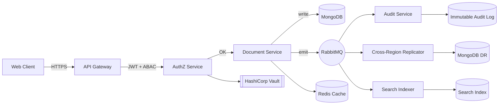

<!--
  ─────────────────────────────────────────────────────────────
  PRABHAKAR KUMAR  ·  Senior Software Engineer
  https://github.com/prabhakar713
  ─────────────────────────────────────────────────────────────
  Mobile-first: NO multi-column HTML tables for prose. GitHub does
  not collapse table columns responsively — every prose column
  would shrink to one word per line on a 375px viewport. Instead
  we use:
    - stacked single-column sections (mobile-safe by default)
    - shields.io badge rows (inline images that wrap naturally)
    - <table> only for actual tabular data (short cell content)
  Every external image URL was verified against a currently-
  healthy public service on the last edit pass.
-->

<!-- ══════════════════════ 1. ANIMATED HEADER ══════════════════════ -->

<!-- ══════════════════════ 3. HERO CTA BADGES (inline images — reflow naturally on any width) ══════════════════════ -->

  

<!-- ══════════════════════ 2. ANIMATED TYPING SVG ══════════════════════ -->

  

<!-- Quick-stat badges — inline images, wrap naturally on 375px viewport (no table). -->

<!-- Gradient divider — matches header palette. -->

 

<!-- ══════════════════════ 4. PROFESSIONAL INTRODUCTION ══════════════════════ -->

## &nbsp;The Pitch

Most engineers pick one lane. I built a career at the intersection of five.

> I design and ship full systems end-to-end &mdash; **backend, frontend, infrastructure, security, and the AI layer on top** &mdash; then I sit *with the customer* to make sure it survives production. That combination &mdash; **builder + forward-deployed problem-solver + AI engineer** &mdash; is why enterprise BFSI teams across APAC and North America have trusted me with their platform experience for 4+ years.

I don't hand off. I don't wait for a ticket. If a customer is blocked at 2 AM, I ship the fix, own the rollback plan, and write the postmortem the same week.

 

<!-- ══════════════════════ 5. ABOUT ME (single-column — mobile-safe) ══════════════════════ -->

## &nbsp;About Me

Senior Software Engineer based in **Bangalore, India**, currently building a secure Virtual Data Room platform for regulated enterprises. Previously **Senior Solution Engineer at Vymo**, where I owned CRM platform delivery for banks, insurers, and financial institutions across APAC and North America.

I care about three things, in this order:

1. **Customer outcome** &mdash; does the change actually move a metric that matters to the business?
2. **System integrity** &mdash; will it still be correct under load, failure, and adversarial input?
3. **Team leverage** &mdash; did I leave the codebase, docs, or on-call runbook better than I found it?

My comfort zone spans **distributed systems, event-driven architectures, secure authorization (RBAC/ABAC), and LLM-powered product features** &mdash; glued together with pragmatic engineering.

<pre lang="yaml">
name:         Prabhakar Kumar
role:         Senior Software Engineer
location:     Bangalore, India
experience:   4+ years
domains:      Enterprise SaaS · BFSI · CRM · Secure Document Rooms · Applied AI
stack:        polyglot full-stack
availability: open to select senior roles
</pre>

 

<!-- ══════════════════════ 6. CAREER TIMELINE (stacked — mobile-safe) ══════════════════════ -->

## &nbsp;Career Timeline

### Senior Software Engineer &nbsp;&middot;&nbsp; <code>Feb 2026 &mdash; Present</code>

**Secure Virtual Data Room Platform** &nbsp;&middot;&nbsp; enterprise-grade document collaboration for M&amp;A, due-diligence, and regulated deal-rooms.

- Designed **RBAC + ABAC** authorization with per-document, per-attribute policy evaluation.
- Built **event-driven microservices** on **RabbitMQ** with idempotent consumers and DLQs.
- Tuned **MongoDB** aggregation pipelines for high-volume cross-region replication.
- Shipped on **Kubernetes** with **Helm**, **Redis** caching, and **HashiCorp Vault** for secret rotation.
- Wrote the audit-logging framework that powers compliance evidence for enterprise customers.

---

### Senior Solution Engineer &nbsp;&middot;&nbsp; Vymo Technologies &nbsp;&middot;&nbsp; <code>Jul 2022 &mdash; Feb 2026</code>

**Enterprise CRM Platform &mdash; BFSI &middot; APAC &amp; North America** &nbsp;&middot;&nbsp; part solution architect, part forward-deployed engineer for banks, insurers, and asset managers.

- Cut CRM data setup and validation effort by **80%** via an in-house automation platform.
- Built high-concurrency **React** dashboards over large customer datasets.
- Integrated Salesforce, Slack, Outlook, and telephony APIs into a unified CRM surface.
- Led **Vymothon** &mdash; the internal AI-driven CRM hackathon &mdash; winning the *New Innovative Award*.
- Was the on-site engineer for enterprise rollouts across three continents.

 

<!-- ══════════════════════ 7. ENGINEERING PHILOSOPHY (stacked — mobile-safe) ══════════════════════ -->

## &nbsp;Engineering Philosophy

**Ship, then harden.** &nbsp; A working v1 in production beats a perfect v2 in a slide deck. Then I go back and add the retries, the metrics, the audit trail, and the failure test.

**Boring where it matters.** &nbsp; Postgres, Redis, RabbitMQ, K8s. I reach for the exotic tool only when the boring one has actually run out of runway &mdash; not before.

**Own the outcome.** &nbsp; I write the code, I do the release, I take the on-call page, I write the postmortem. The loop closes on me.

**Design for the auditor.** &nbsp; In BFSI and secure-data work, "it works" is not enough &mdash; every action needs to be logged, attributable, and reversible.

 

<!-- ══════════════════════ 8. CAREER HIGHLIGHTS (badges — wrap naturally) ══════════════════════ -->

## &nbsp;Career Highlights

 

<!-- ══════════════════════ 9. ENTERPRISE EXPERIENCE (stacked — mobile-safe) ══════════════════════ -->

## &nbsp;Enterprise Experience

**Regions** &nbsp;&middot;&nbsp; APAC (India, Singapore, Indonesia, Vietnam) &nbsp;&middot;&nbsp; North America (United States, Canada) &nbsp;&middot;&nbsp; follow-the-sun deployment cycles.

**Verticals** &nbsp;&middot;&nbsp; Banks &amp; NBFCs &nbsp;&middot;&nbsp; Life &amp; general insurance &nbsp;&middot;&nbsp; Wealth &amp; asset management &nbsp;&middot;&nbsp; M&amp;A / secure deal rooms.

**Delivery Modes** &nbsp;&middot;&nbsp; Forward-deployed on customer sites &nbsp;&middot;&nbsp; Solution design workshops &nbsp;&middot;&nbsp; Custom integration engineering &nbsp;&middot;&nbsp; Production incident ownership.

 

<!-- ══════════════════════ 10. IMPACT METRICS (badges — wrap naturally on 375px) ══════════════════════ -->

## &nbsp;Impact, In Numbers

 

<!-- Divider between story/impact and technical detail. -->

 

<!-- ══════════════════════ 11 + 12. TECH STACK (badges — wrap naturally) ══════════════════════ -->

## &nbsp;Tech Stack

<b>LANGUAGES</b>
 

  

<b>FRONTEND</b>
 

  

<b>BACKEND</b>
 

  

<b>DATABASES</b>
 

  

<b>MESSAGING &amp; STREAMING</b>
 

  

<b>CLOUD &amp; DEVOPS</b>
 

  

<b>SECURITY &amp; AUTH</b>
 

  

<b>AI &amp; LLM</b>
 

  

<b>TOOLS &amp; TESTING</b>
 

 

<!-- ══════════════════════ 13. ARCHITECTURE EXPERTISE ══════════════════════ -->

## &nbsp;Architecture Expertise

I design systems the way I would want to inherit them: **small services, explicit contracts, and no magic.**

<b>System sketch (click to expand)</b>

 

<b>Design principles I actually follow</b>

 

- **Explicit contracts over shared code.** Services own their schemas; the wire format (OpenAPI / AsyncAPI) is the contract, not the SDK.
- **Idempotent consumers, always.** Every RabbitMQ handler assumes at-least-once delivery and de-duplicates on a business key.
- **Backpressure over unbounded queues.** Prefetch limits + DLQs + retry with jittered backoff, not "just add more workers".
- **Read/write path separation.** Hot reads go through Redis; writes go through the service of record; search is a projection, never the source of truth.
- **Zero-downtime schemas.** Expand &rarr; migrate &rarr; contract. No breaking schema change ever ships in a single deploy.
- **Feature flags are policy, not code.** Rollouts are a config change, killable in seconds without a deploy.

 

<!-- ══════════════════════ 14. SECURITY EXPERTISE (single-column — mobile-safe) ══════════════════════ -->

## &nbsp;Security Expertise

Security is not a feature I bolt on at the end &mdash; in BFSI and secure-data platforms it *is* the product.

<b>Areas I own</b>

 

#### AuthN / AuthZ
- JWT with short-lived access + rotating refresh tokens
- OAuth2 / OIDC integrations with enterprise IdPs
- **RBAC** for coarse roles, **ABAC** for per-document / per-attribute policy
- Policy evaluation cached and instrumented for hot paths

#### Secrets &amp; Data
- HashiCorp **Vault** for dynamic DB credentials and secret rotation
- Field-level encryption for regulated PII
- At-rest + in-transit encryption as the default, not a checkbox
- Signed URLs for document access with narrow TTLs

#### Audit &amp; Compliance
- Append-only audit log with tamper-evident hashing
- Actor / resource / decision recorded on every sensitive op
- Evidence exports for enterprise compliance reviews

#### Application Hardening
- Input validation at the edge, output encoding at the sink
- Rate-limits + abuse detection on auth surfaces
- Dependency scanning + SBOM in CI

 

<!-- ══════════════════════ 15. AI EXPERTISE ══════════════════════ -->

## &nbsp;AI Expertise

I use LLMs the same way I use any other dependency &mdash; **with an eval, a fallback, and a cost budget.**

<b>How I build AI product features</b>

 

- **Product-first, model-second.** I define the eval and the UX before I pick the model.
- **Retrieval over fine-tuning** for most enterprise use-cases &mdash; cheaper, updatable, and auditable.
- **Structured outputs** (JSON schema / function-calling) so downstream systems don't have to parse prose.
- **Agentic workflows with `LangGraph`** where the task has real branching; simple `LangChain` chains where it does not.
- **Guardrails on every seam** &mdash; input sanitation, output validation, prompt-injection defenses, and PII redaction.
- **Cost + latency dashboards** on day one so a runaway agent gets caught before it gets billed.

**Working areas** &nbsp;&middot;&nbsp; LLM workflows (OpenAI, function calling, streaming) &nbsp;&middot;&nbsp; agents &amp; orchestration (LangChain, LangGraph) &nbsp;&middot;&nbsp; product integrations (voice&nbsp;&rarr;&nbsp;text, lead scoring, CRM copilots, document Q&amp;A).

 

<!-- ══════════════════════ 16. CLOUD EXPERTISE (single-column) ══════════════════════ -->

## &nbsp;Cloud &amp; Infrastructure Expertise

<b>What I run and how I run it</b>

 

#### Container Platform
- **Kubernetes** &mdash; Deployments, StatefulSets, HPAs, PDBs, NetworkPolicies
- **Helm** &mdash; versioned charts with env-scoped values
- **Docker** &mdash; multi-stage builds, distroless base images, non-root by default

#### Cloud Services
- **AWS** &mdash; EC2, S3, RDS, IAM, CloudWatch, Route53
- **Nginx** &mdash; TLS termination, rate limiting, canary routing
- **Redis** &mdash; cache-aside, rate limiting, session store

#### Delivery
- **GitHub Actions** &mdash; build, test, scan, sign, deploy
- Blue/green + canary rollouts with health-gated promotion
- Environment parity via Helm values + sealed secrets

#### Observability
- Structured logs with correlation IDs across services
- RED metrics on every service, USE metrics on every node
- SLOs published; alerts routed by service ownership

 

<!-- Divider before project showcase. -->

 

<!-- ══════════════════════ 17. FEATURED PROJECTS (single-column stacked cards) ══════════════════════ -->

## &nbsp;Featured Projects

### Virtual Data Room Platform
<i>Senior SWE &middot; Security &middot; Distributed Systems</i>

Enterprise-grade secure document collaboration for M&amp;A and due-diligence workflows. Owned the RBAC/ABAC authorization layer, the audit-logging framework, the event-driven microservices topology, and cross-region MongoDB replication.

---

### Intelligent Lead Platform
<i>AI Engineering &middot; Full-Stack</i>

AI-driven lead scoring, cohorting, and real-time allocation &mdash; routes leads across AI outreach, bot calling, and human sellers based on live signals. Built end-to-end from the ML-served scoring API to the operator dashboard.

---

### CRM Automation Platform
<i>Full-Stack &middot; Platform Engineering</i>

Data setup, validation, scheduling, and broadcast automation for enterprise CRM rollouts. **Cut setup time by 80%** &mdash; the reason the biggest APAC banks and insurers could onboard in days, not months.

---

### Voice &rarr; Text
<i>Applied AI &middot; Product</i>

Real-time voice-to-text pipeline with streaming transcription and speaker awareness. Built as an applied-AI exploration on top of streaming speech APIs and LLM post-processing for cleanup and structuring.

---

### AI Applications
<i>LLM &middot; Agents &middot; Prompt Engineering</i>

Internal AI tools &mdash; document Q&amp;A copilots, agentic workflows on LangGraph, and CRM-side LLM assistants for enterprise reps. All shipped with evals, cost budgets, and guardrails.

 

 

<!-- Divider before analytics. -->

 

<!-- ══════════════════════ 18-22. GITHUB ANALYTICS (all reliable services) ══════════════════════ -->

## &nbsp;GitHub Analytics

<!-- Reliable stat badge row (shields.io — always renders). -->

  

<!-- Streak (streak-stats.demolab.com — reliable). -->

  

<!-- Activity graph — reliable. -->

  

<!-- Full-year contribution grid — reliable. -->

  

<b>PRIMARY LANGUAGES</b>
 

 

<!-- ══════════════════════ 22. RECOGNITION STRIP ══════════════════════ -->

## &nbsp;Recognition Strip

 

<!-- ══════════════════════ 23. SNAKE ANIMATION ══════════════════════ -->

## &nbsp;Contribution Snake

  <picture>
    <source media="(prefers-color-scheme: dark)" srcset="https://raw.githubusercontent.com/prabhakar713/prabhakar713/output/github-contribution-grid-snake-dark.svg"/>
    <source media="(prefers-color-scheme: light)" srcset="https://raw.githubusercontent.com/prabhakar713/prabhakar713/output/github-contribution-grid-snake.svg"/>
    
  </picture>

<i>Snake image is generated by a scheduled GitHub Action &mdash; setup instructions in the comment block at the bottom of this file.</i>

 

<!-- ══════════════════════ 24. OPEN SOURCE GOALS ══════════════════════ -->

## &nbsp;Open Source Goals

- Publish a minimal, production-shaped **RBAC + ABAC** reference implementation in TypeScript.
- Ship a small **LangGraph** starter for enterprise document Q&amp;A with eval baked in.
- Contribute upstream to a message-broker or observability project I use in production.
- Write one deeply-technical blog post per quarter &mdash; no listicles, no filler.
- Mentor at least two junior engineers into their first production incident (and out of it).

 

<!-- ══════════════════════ 25. CURRENT FOCUS (stacked — mobile-safe) ══════════════════════ -->

## &nbsp;Current Focus

**Building** &nbsp;&middot;&nbsp; Secure Virtual Data Room platform (auth, audit, replication) &nbsp;&middot;&nbsp; event-driven microservices with idempotent consumers &nbsp;&middot;&nbsp; LLM-backed document intelligence features.

**Learning** &nbsp;&middot;&nbsp; Advanced Kubernetes operators &amp; controller patterns &nbsp;&middot;&nbsp; deeper LangGraph agent design + evals &nbsp;&middot;&nbsp; system design for regulated multi-region workloads.

 

<!-- ══════════════════════ 26. LEARNING ROADMAP ══════════════════════ -->

## &nbsp;Learning Roadmap

<b>The next 6 months</b>

 

- [x] Ship RBAC + ABAC framework in production
- [x] Introduce audit-log tamper-evidence for compliance evidence
- [x] Stand up Vault-backed secret rotation
- [ ] Publish an internal design doc on event-driven consistency patterns
- [ ] Ship a LangGraph-based document copilot with structured outputs + evals
- [ ] Complete a Kubernetes operator for a domain-specific controller
- [ ] AWS Certified Solutions Architect &mdash; Associate
- [ ] Deep-dive into vector search internals (HNSW, IVF, quantization)
- [ ] First open-source release under my GitHub with real users

<b>Longer horizon</b>

 

- Deeper systems programming &mdash; Rust for infra components
- Distributed consensus (Raft, Paxos) beyond the textbook
- Applied ML systems &mdash; feature stores, model serving, drift detection
- Product engineering leadership &mdash; small teams, high leverage

 

<!-- ══════════════════════ 27. WRITING & TALKS (short cells — safe in table) ══════════════════════ -->

## &nbsp;Writing &amp; Talks

<table>
<tr>
<th align="left">Title</th>
<th align="left">Status</th>
</tr>
<tr>
<td>Designing RBAC + ABAC for a Secure Document Platform</td>
<td></td>
</tr>
<tr>
<td>Event-Driven Microservices: What I Wish I Knew on Day One</td>
<td></td>
</tr>
<tr>
<td>Shipping LLM Features That Don't Embarrass You in Production</td>
<td></td>
</tr>
<tr>
<td>Forward-Deployed Engineering: The Underrated Career Path</td>
<td></td>
</tr>
</table>

 

<!-- ══════════════════════ 28. CERTIFICATIONS (short cells — safe in table) ══════════════════════ -->

## &nbsp;Certifications

<table>
<tr>
<th align="left">Certification</th>
<th align="left">Status</th>
</tr>
<tr>
<td>AWS Certified Solutions Architect &mdash; Associate</td>
<td></td>
</tr>
<tr>
<td>Certified Kubernetes Application Developer (CKAD)</td>
<td></td>
</tr>
<tr>
<td>HashiCorp Certified: Vault Associate</td>
<td></td>
</tr>
<tr>
<td>MongoDB Associate Developer</td>
<td></td>
</tr>
</table>

 

<!-- ══════════════════════ 29. AWARDS (badges — wrap naturally) ══════════════════════ -->

## &nbsp;Awards &amp; Recognition

 

 

 

<!-- ══════════════════════ 30. FUN FACTS ══════════════════════ -->

## &nbsp;Fun Facts

- I have shipped code from three continents in a single quarter.
- My favorite debugging tool is still `console.log` &mdash; and I refuse to apologize for it.
- I read one systems paper a week. Recent favorites: DynamoDB, Kafka, and the Tigerbeetle design docs.
- I keep a personal on-call runbook &mdash; for my own life, not just my services.
- Non-negotiable morning routine: black coffee, one deep-work block, then meetings.

 

<!-- ══════════════════════ 31. QUOTES ══════════════════════ -->

## &nbsp;Engineering Quotes I Live By

> "I don't just write the code &mdash; I make sure it survives contact with a real customer."
> &mdash; *my working definition of a Forward-Deployed Engineer*

> "Make it work, make it right, make it fast &mdash; in that order, and never skip the middle step."
> &mdash; *Kent Beck*

> "The most dangerous phrase in production is: it worked on staging."
> &mdash; *every SRE, eventually*

 

<!-- Divider before contact. -->

 

<!-- ══════════════════════ 32. CONTACT (single-column — mobile-safe) ══════════════════════ -->

## &nbsp;Let's Talk

  

 

**Reach me on** &nbsp;&middot;&nbsp; LinkedIn DM or email &mdash; read daily, replied to within 24 hours on weekdays.

**Yes to** &nbsp;&middot;&nbsp; Senior IC roles, AI/LLM product engineering, forward-deployed engineering, and technical solution engineering at high-trust teams.

**Not looking for** &nbsp;&middot;&nbsp; Cold recruiter blasts, unpaid "quick chats", or crypto-in-name-only roles. Everything else &mdash; always happy to talk.

<i>Based in Bangalore, India &nbsp;&middot;&nbsp; open to remote and hybrid &nbsp;&middot;&nbsp; work-authorized in India</i>

 

<!-- ══════════════════════ 33. FOOTER ══════════════════════ -->

  If this profile made you pause &mdash; that was the point.
    
  <a href="https://github.com/prabhakar713"><b>github.com/prabhakar713</b></a>

<!--
  ─────────────────────────────────────────────────────────────
  Snake Animation Setup (one-time)
  ─────────────────────────────────────────────────────────────
  Enable the Contribution Snake image (section 23) with:

  1. Create .github/workflows/snake.yml with the content below.
  2. Settings → Actions → General → Workflow permissions
        → set "Read and write permissions".
  3. Actions tab → run the workflow once manually to seed the
     "output" branch. It re-runs every 12 hours after that.

  --- .github/workflows/snake.yml ---
  name: Generate Snake

  on:
    schedule:
      - cron: "0 */12 * * *"
    workflow_dispatch:
    push:
      branches: [ main ]

  jobs:
    generate:
      runs-on: ubuntu-latest
      permissions:
        contents: write
      steps:
        - uses: Platane/snk@v3
          id: snake
          with:
            github_user_name: prabhakar713
            outputs: |
              dist/github-contribution-grid-snake.svg
              dist/github-contribution-grid-snake-dark.svg?palette=github-dark

        - uses: crazy-max/ghaction-github-pages@v4
          with:
            target_branch: output
            build_dir: dist
          env:
            GITHUB_TOKEN: ${{ secrets.GITHUB_TOKEN }}
  ------------------------------------
-->
